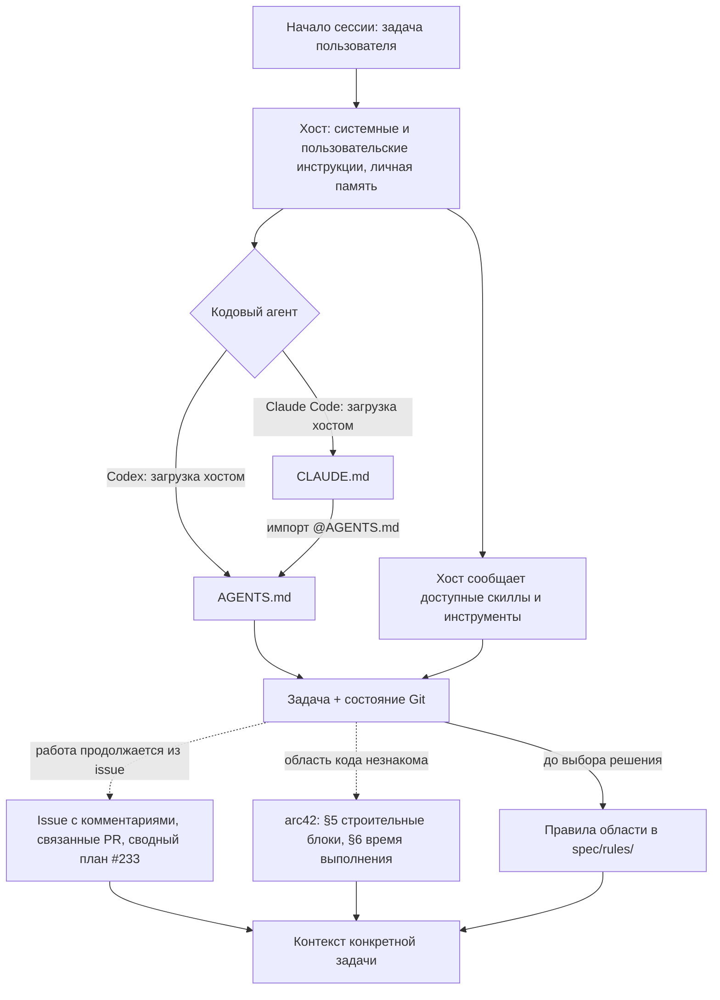
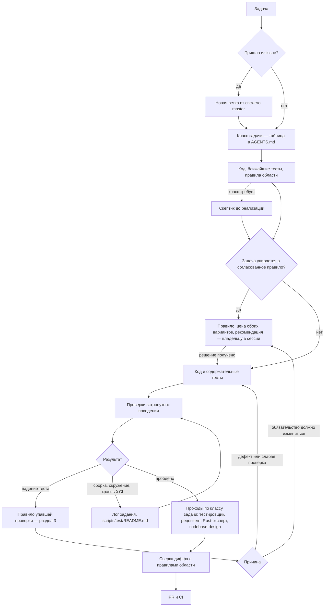

# Как агент получает контекст для разработки v8-runner

Схема от 24.09.2026. Она показывает, **когда агент узнаёт ограничение и что вызывает
следующее чтение**. Сами маршруты задаёт [`AGENTS.md`](AGENTS.md): что читать сначала,
что дочитывать по ходу задачи, как поступать, когда правило расходится с кодом. Обязательства
задаёт только он; где карта подробнее, она поясняет, как пройти его маршрут. Разойдутся —
прав `AGENTS.md`, а карту правят в том же изменении, как он и требует.

Карту читают, когда меняют сами маршруты, и когда требуемого скилла нет — за его источником
в разделе 4. Перед обычной правкой она не нужна.

## 1. Старт сессии

Сплошная стрелка — загрузка хостом или чтение агентом. Пунктир — чтение при названном
условии. Схема логическая: внутренний порядок действий у Codex и Claude Code может
отличаться.



Codex получает `AGENTS.md` своей цепочкой инструкций. Claude Code читает `CLAUDE.md`, а
тот одной строкой подключает `AGENTS.md`. Без подключения Claude Code читает `AGENTS.md`
только с версии 2.1.277, только когда в рабочем каталоге и выше нет ни `CLAUDE.md`, ни
`.claude/CLAUDE.md`, ни `CLAUDE.local.md`, и не в каждой сессии. Терминальный `claude` на
машине владельца 24.09.2026 был версии 2.1.247 — без такой поддержки — и до появления
`CLAUDE.md` правил проекта не получал вовсе. Основание:
[Anthropic — AGENTS.md](https://code.claude.com/docs/en/memory#agents-md).

У подключения есть цена. С `CLAUDE.md` в корне Claude Code сам `AGENTS.md` больше не ищет, и
сессии, начатой из подкаталога, `AGENTS.md` достаётся внешним импортом: Claude Code спросит
разрешения и запомнит отказ. Поэтому сессию начинают в корне репозитория или worktree.
Когда все сессии будут читать `AGENTS.md` сами, `CLAUDE.md` можно убрать — так советует та же
документация.

Личная память хоста — выученное у конкретного пользователя между сессиями. В репозитории её
нет; что должно дойти до любого агента, `AGENTS.md` велит записывать в файл на маршруте.

## 2. Работа над задачей

Маршрут, который задаёт `AGENTS.md`. Что дочитывать по ходу задачи, называет его таблица
«Read next when the task reaches it»; здесь — поток.



Правила читаются **до выбора решения** и ещё раз после падения теста. Одного чтения
после ошибки мало: теста может не быть в прогоне, он может быть неполным или исправленным
вместе с кодом.

## 3. Как падение теста приводит к чтению правила

`cargo test` правил в контекст не загружает и в ошибку ссылку на правило не добавляет.
Переход делает агент. Правило называет свои проверки адресом `путь::имя`, а пока гарантия
не выполнена — задачу в поле `gap`; сегодня так у 31 правила из 167.

1. Взять исходную ошибку и имя теста. Интеграционный тест cargo печатает строкой
   `Running tests/<файл>.rs` и `test <имя> ... FAILED`; модульный — путём модуля
   (`platform::git::tests::<имя>`), а правило называет файл (`src/platform/git.rs::<имя>`).
   Отличить падение утверждения от сбоя сборки или запуска.
2. Открыть объявление и тело теста.
3. Найти правило по имени проверки:

   ```sh
   rg -n -F '::an_ignored_file_is_at_risk_although_the_tree_looks_clean' spec/rules/
   ```

   Поиск находит `use-cases/replacing-a-user-directory-asks-first.md`. Что адрес в `check`
   существует и указывает на настоящий тест, держит гейт
   `tests/arch_rules.rs::every_named_check_exists`.
4. Сопоставить ожидание теста, правило и поведение — порядок в разделе `AGENTS.md`
   «When a Rule and the Code Disagree».
5. Исправить причину, выполнить точный тест, затем связанные.

Связь «тест — правило» не обязана быть взаимной: у многих тестов правила нет, и заводить
его ради связи не нужно. Отсутствие правила не разрешает менять поведение или удалять
содержательный тест.

Тесты, которые на macOS падают независимо от изменения, перечислены в
[`scripts/test/README.md`](scripts/test/README.md), раздел «Известные нестабильные тесты».

## 4. Скиллы

Проектных скиллов разработки в дереве нет: каталоги `.claude/`, `.agents` и `.codex/`
исключены из Git через `.gitignore`.

`AGENTS.md` требует трёх внешних скиллов. Ставят их из источников ниже в каталог
пользователя — `~/.claude/skills/<имя>/` для Claude Code, `~/.codex/skills/<имя>/` для Codex:

| Скилл | Источник |
| --- | --- |
| `rust-expert-best-practices-code-review` | `wispbit-ai/skills`, каталог `skills/rust-expert-best-practices-code-review/` |
| `skeptic-review` | `alkoleft/my-ai-skills`, каталог `skeptic-review/` — набор автора исходного репозитория `alkoleft/v8-runner-rust` |
| `codebase-design` | `mattpocock/skills`, каталог `skills/engineering/codebase-design/`; ставится отдельным скиллом, без остального плагина |

`skills-lock.json` закрепляет только первый. На машине владельца все три поставлены
24.09.2026; до того их не было, и проходы подменял агент общего назначения с тем же
перечнем проверок. Пропуск прохода Rust-эксперта `AGENTS.md` называет нарушением, а
принятые отступления от любого прохода — делом владельца.

[`SKILL/SKILL.md`](SKILL/SKILL.md) вместе с `SKILL/agents/openai.yaml` — продуктовый скилл:
как пользоваться v8-runner в проектах 1С. Для разработки самого раннера он не нужен; его
правят, когда меняется то, что важно снаружи.

## 5. MCP и инструменты разработки

Для разработки **обязательных MCP-серверов нет**: хватает shell, Git, `cargo` и `gh`.

v8-runner сам — MCP-сервер (`v8-runner mcp serve stdio|http`) и в MCP-сценариях служит
проверяемым продуктом. Состав его инструментов держит правило
[`CTR.MCP.PUBLISHED-TOOL-SURFACE`](spec/rules/mcp/published-tool-surface.md): оно
перечисляет инструменты и места, которые правятся вместе при смене состава; схема входа
каждого — `docs/schemas/mcp-tools.json`.

Платформы 1С в сессии разработки может не быть. Поведение утилит тогда берётся из замеров
[`references/1c/confirmed-runtime-measurements.md`](references/1c/confirmed-runtime-measurements.md)
и корпуса команд рядом с ним; корпус обычному `rg` не виден — `rg -uu` или `git grep`.

## 6. Где живёт каждая обязанность

| Файл | Роль | Как до него доходят |
| --- | --- | --- |
| `CLAUDE.md` | Подключить `AGENTS.md` для Claude Code | Хостом, автоматически |
| `AGENTS.md` | Вход: что читать сначала и по ходу задачи, классы задач, проходы проверки, расхождение правила с кодом, формат коммита | Хостом, на старте |
| `spec/rules/**` | Согласованные гарантии продукта | До выбора решения — по области; после падения — по `check` |
| `spec/rules/README.md`, `tests/arch_rules.rs` | Как устроено правило; гейт реестра | Из `AGENTS.md`; гейт падает сам |
| `spec/arc42/` | Описание устройства: карта модулей (§5 — единственная), потоки, сквозные механизмы, риски, глоссарий | Из `AGENTS.md` — для незнакомой области; §8 — по ссылкам из §5 и §6, §12 — из индекса |
| `docs/README.md`, `spec/README.md` | Какой источник на что отвечает — для людей | Из `README.md` |
| `README.md`, `docs/CAPABILITIES.md`, `docs/CONFIGURATION.md`, `docs/DEEP_DIVE.md` | Публичное описание команд, конфига и работы | Из `AGENTS.md` — при смене формы, ключей, конфига и при новом `gap` о видимом пользователю поведении |
| `SKILL/SKILL.md` | Скилл пользования v8-runner во внешних проектах | Из `AGENTS.md` — при смене внешнего использования |
| `references/1c/` | Корпус команд платформы и замеры на живой платформе | Из `AGENTS.md` — при работе с адаптерами платформы |
| `scripts/test/README.md` | Контракт CI по ОС, известные нестабильные тесты, PR из форка без проверок | Из `AGENTS.md` — когда CI красный или не стартовал |
| `docs/provenance/upstream-migration/README.md` | Запись о переносе форка; ветки `quarantine/*` — запертое свидетельство | Из `AGENTS.md` — при работе с историей форка |
| `docs/site/README.md` | Устройство сайта целевой модели 1.0 и правила его языка | Из `AGENTS.md` — при правке сайта |
| Issues, сводный план #233 | Планы, решения владельца, остаток работы | Из `AGENTS.md` — при продолжении работы |
| История Git | Прежние правила и удалённые решения | Из `AGENTS.md` — за историей выбора |
| Личная память хоста | Выученное у конкретного пользователя | Хостом, автоматически |
| `AI_DEV.md` | Эта карта | Из `AGENTS.md` — при изменении маршрутов и за источником недостающего скилла |

Ссылка нужна там, где у агента возникает решение дочитать источник. Документ для агентов, до
которого не ведёт ни один маршрут, бесполезен: `AGENTS.md` велит его либо связать с
маршрутом, либо убрать. Документы для людей — `README.md`, `FORK_NOTICE.md`, `docs/README.md` —
этим правилом не связаны.

Маршрут подключён файлами, но это ещё не доказывает поведения хоста. Проверяют его новые
сессии: что попало в контекст, какое правило прочитано до решения, что дочитано после
падения. `CLAUDE.md` заведён 24.09.2026; живой терминальной сессией его подключение не
проверено — `claude` на машине владельца в тот день не был авторизован.
