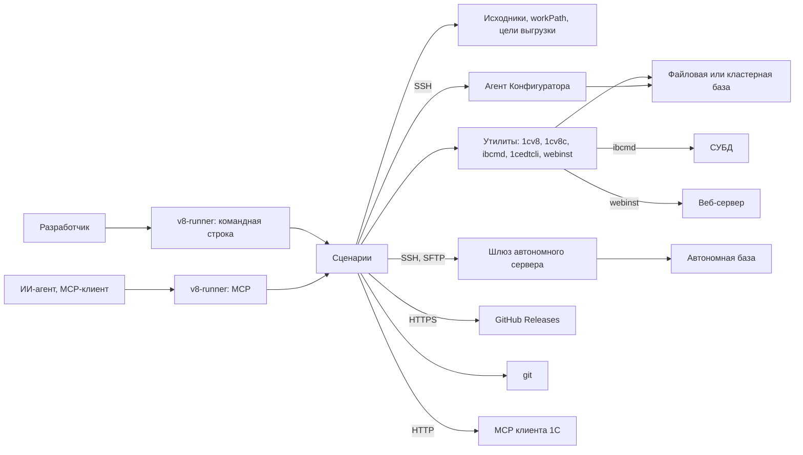

## 3. Контекст и границы

| Внешняя система | Канал | Где в коде | Кто пользуется |
| --- | --- | --- | --- |
| Конфигуратор, пакетный | Процесс `1cv8 DESIGNER`; создание файловой базы — `1cv8 CREATEINFOBASE` | [`designer.rs`](../../src/platform/designer.rs) | `push`, `pull`, `upload`, `download`, `make`, `check`, `infobase create`, `dump`, `restore`, `clone` |
| Клиенты платформы | Процесс `1cv8c`, `1cv8 ENTERPRISE` или `1cv8 DESIGNER` для `launch designer` | [`enterprise.rs`](../../src/platform/enterprise.rs) | `test`, `launch` |
| `ibcmd` | Процесс; у серверной базы — прямо в СУБД | [`ibcmd.rs`](../../src/platform/ibcmd.rs) | `extensions`; `push`, `pull`, `download`, `infobase create` — вторым в цепочке или по ключу; проба расширения у `upload` |
| EDT | Процесс `1cedtcli`, одноразовый или долгий | [`edt.rs`](../../src/platform/edt.rs), [`edt_session.rs`](../../src/platform/edt_session.rs) | `check`, `convert`, `push` и `pull` формата EDT, `infobase create`, `make` |
| Агент Конфигуратора | SSH встроенным клиентом: свой — на петлевом адресе, чужой — по `tools.designer_agent.attach` | [`agent.rs`](../../src/platform/agent.rs) | По ключу `providers.*`: `push`, `pull`, `make`, `extensions`, `download`, `infobase dump`, `restore` |
| Шлюз автономного сервера | SSH; файлы — SFTP того же соединения или общий каталог | [`agent.rs`](../../src/platform/agent.rs), [`sftp.rs`](../../src/platform/sftp.rs) | `push`, `pull`, `make`, `extensions`, `download` |
| Веб-сервер | Процесс `webinst` | [`webinst.rs`](../../src/platform/webinst.rs) | `publish` |
| MCP клиента 1С | HTTP на петлевом адресе | [`client_mcp_readiness.rs`](../../src/use_cases/client_mcp_readiness.rs) | `launch mcp` с ожиданием готовности |
| GitHub Releases | HTTPS | [`download.rs`](../../src/platform/download.rs) | `tools download` |
| git | Процесс `git` | [`git.rs`](../../src/platform/git.rs) | `init`; вопрос перед заменой каталога человека |
| Браузер | Обработчик адресов ОС | [`browser.rs`](../../src/platform/browser.rs) | `launch web` |
| MCP-клиенты | stdio или HTTP | [`mcp/server.rs`](../../src/mcp/server.rs) | `mcp serve` |

Внутри границы: разбор запроса, проверка конфигурации, выбор исполнителя, анализ
изменений, оркестрация шагов, разбор журналов и отчётов, публикация с заменой, замки,
допуск и сессии MCP. Снаружи: поведение платформы и EDT, устройство YaXUnit и Vanessa,
установка утилит, кластер, пользователи и права.
