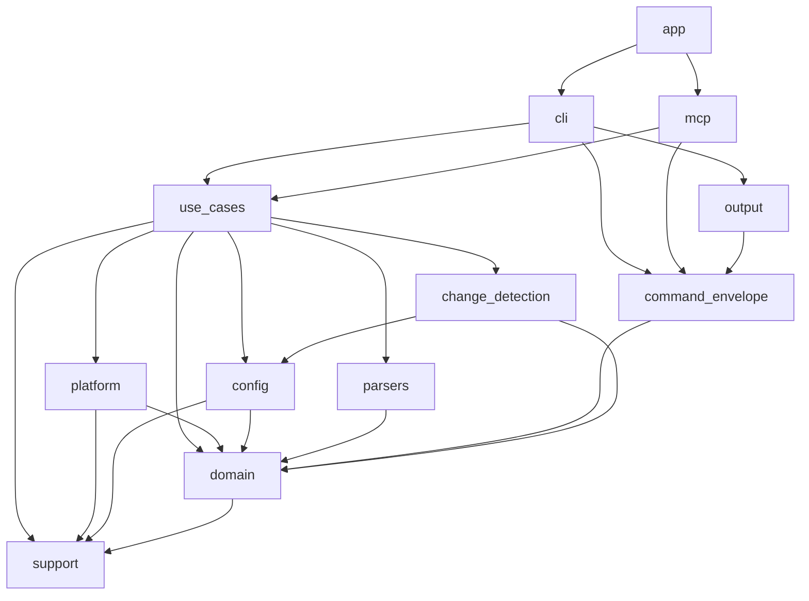

## 5. Строительные блоки

Один бинарный крейт: [`src/main.rs`](../../src/main.rs) объявляет модули верхнего уровня
и передаёт управление `app::run`. Раздел отвечает на вопросы, на которые поиск по коду не
отвечает быстро: чем владеет модуль и куда смотрят его зависимости.

### 5.1 Модули

| Модуль | Чем владеет | С чего читать |
| --- | --- | --- |
| [`app`](../../src/app.rs) | Старт процесса: разбор командной строки, прежние имена команд, отказ несовместимых глобальных ключей, загрузка конфигурации по виду команды, запуск MCP-сервера. Сам исполняет и выводит `version`, `clone`, `init` | `run` |
| [`cli`](../../src/cli/) | Дерево команд, перевод аргументов в запросы, замок `workPath` командной строки, текст и конверт ответа, Ctrl+C и SIGTERM как отмена | [`execute.rs`](../../src/cli/execute.rs), [`global_flags.rs`](../../src/cli/global_flags.rs) — у каких команд есть превью |
| [`mcp`](../../src/mcp/) | Сервер по stdio и HTTP: допуск вызовов, сессии, входные DTO, сервисный слой над сценариями, замок `workPath` для MCP, живая EDT-проверка, телеметрия | [`server.rs`](../../src/mcp/server.rs), [`service.rs`](../../src/mcp/service.rs), [`port.rs`](../../src/mcp/port.rs) |
| [`use_cases`](../../src/use_cases/) | Сценарии всех команд, общие для CLI и MCP, и то, что нужно нескольким сценариям сразу — 5.4 | [`context.rs`](../../src/use_cases/context.rs), [`request.rs`](../../src/use_cases/request.rs), [`result.rs`](../../src/use_cases/result.rs) |
| [`domain`](../../src/domain/) | Результаты команд и часть запросов; грамматика исполнения `ExecutionOutcome<T>`, `StepResult`; матрица исполнителей | [`execution.rs`](../../src/domain/execution.rs), [`capability.rs`](../../src/domain/capability.rs) |
| [`config`](../../src/config/) | Чтение `v8project.yaml` и местного слоя, модель `AppConfig`, схемы, проверка по виду команды | [`loader.rs`](../../src/config/loader.rs), [`validate.rs`](../../src/config/validate.rs) |
| [`platform`](../../src/platform/) | Всё за пределами процесса — 5.5 | [`utilities.rs`](../../src/platform/utilities.rs) |
| [`change_detection`](../../src/change_detection/) | Обход дерева, отметки времени и хеши, хранилище redb на контекст, решение о частичной загрузке | [`analyzer.rs`](../../src/change_detection/analyzer.rs), [`partial_load.rs`](../../src/change_detection/partial_load.rs) |
| [`parsers`](../../src/parsers/) | JUnit, журналы YaXUnit и Vanessa, журналы проверки Конфигуратора и EDT. Ответы `ibcmd` и агента разбирают `platform` и сценарии | [`mod.rs`](../../src/parsers/mod.rs) |
| [`output`](../../src/output/) | Вывод командной строки: `Presenter`, словарь текстовой ленты | [`text.rs`](../../src/output/text.rs) |
| [`command_envelope`](../../src/command_envelope.rs) | Конверт ответа `Envelope<T>`, закрытые наборы родов и кодов отказа | `Envelope` |
| [`command_data`](../../src/command_data.rs) | Таблица «команда → схема поля `data`». Программа её не вызывает, по ней тесты сверяют порождённые схемы | `command_data_forms!` |
| [`support`](../../src/support/) | Общая ошибка `AppError`; файловые примитивы — замки, атомарная замена, метаданные временных каталогов; журналы; пути; разбор адресов; нормализация ввода CLI и MCP | [`fs.rs`](../../src/support/fs.rs), [`error.rs`](../../src/support/error.rs) |

### 5.2 Зависимости

Основное направление — сверху вниз. `app` смотрит в большинство модулей; адаптеры, кроме
показанного, берут `domain`, `config` и `support`; друг о друге они не знают.

Против направления идут рёбра ниже, и из-за них большая часть модулей связана в один цикл:
`support → platform` и `support → config` — `AppError` оборачивает их ошибки;
`support → use_cases` — нормализация ввода возвращает типы запросов; `support → output` —
журнал берёт знак статуса из словаря ленты; одно из пары `config ↔ platform` — модель
строит подключение платформы, а платформа читает модель. Мимо сценариев идут
`mcp → platform` и `mcp → parsers` — живая EDT-проверка ([6.7](06-runtime-view.md)). `command_data` смотрит в `app`,
`cli` и `mcp` ради схем их данных.

Границы, которые держат правила: сценарии не знают транспорта и вывода
([правило](../rules/use-cases/no-transport-types-in-the-use-case-layer.md)); процесс
запускает только `platform` ([правило](../rules/platform/process-spawn-stays-in-platform.md)),
а файловая система так не ограничена; команду с аргументами показывает только владелец
маскирования ([правило](../rules/platform/command-display-has-one-owner.md)).

### 5.3 Команда → сценарий

Сценарий команды — модуль [`use_cases`](../../src/use_cases/), адаптер — функция
`execute_*` в [`cli/execute.rs`](../../src/cli/execute.rs); `version`, `clone`, `init` и
`mcp serve` разбирает `app.rs`. Имена в коде старше имён команд: `push` — `build_project`,
`pull` — `dump_config`, `upload` — `load_artifact`, `check` — `check_syntax`, `make` —
`artifacts`, `clone` — `bootstrap_project`, `init` — `config_init`, `infobase create` —
`init_project` (в `CommandName` — `Init`), `download`, `infobase dump` и `restore` —
`infobase_export`, `extensions` — `configure_extensions` и `extension_inventory`, `test` —
`run_tests`. Инструменты MCP зовут те же сценарии через `mcp/service.rs`; их состав держит
[правило](../rules/mcp/published-tool-surface.md).

### 5.4 Общее в `use_cases`

| Файл | Что в нём |
| --- | --- |
| [`transport.rs`](../../src/use_cases/transport.rs), [`workspace_lock.rs`](../../src/use_cases/workspace_lock.rs) | Вызов сценария под замком `workPath` — общий для CLI и MCP |
| [`provider_selection.rs`](../../src/use_cases/provider_selection.rs) | Выбор исполнителя и квитанция — [6.2](06-runtime-view.md) |
| [`agent_session.rs`](../../src/use_cases/agent_session.rs) | Сессия агента на команду, обмен файлами, поколение — [6.4](06-runtime-view.md) |
| [`staged_publication.rs`](../../src/use_cases/staged_publication.rs), [`destruction_guard.rs`](../../src/use_cases/destruction_guard.rs) | Публикация с заменой и вопрос к git — [8.8](08-cross-cutting-concepts.md) |
| [`interruption.rs`](../../src/use_cases/interruption.rs) | Слова о прерывании — [8.7](08-cross-cutting-concepts.md) |
| [`progress.rs`](../../src/use_cases/progress.rs) | События живой ленты текстового вывода |
| [`source_inventory.rs`](../../src/use_cases/source_inventory.rs) | Наборы исходников проекта в порядке обработки |
| [`tool_extension.rs`](../../src/use_cases/tool_extension.rs) | Расширение-инструмент клиентского MCP |

### 5.5 `platform`

| Файл | Что в нём |
| --- | --- |
| [`utilities.rs`](../../src/platform/utilities.rs), [`locator.rs`](../../src/platform/locator.rs) | Вход для сценариев; поиск утилит по маске версии — [правило](../rules/platform/platform-tools-are-found-by-version-mask.md) |
| [`process.rs`](../../src/platform/process.rs) | Процесс в своей группе, класс прерывания, снятие группы |
| [`designer.rs`](../../src/platform/designer.rs), [`ibcmd.rs`](../../src/platform/ibcmd.rs), [`edt.rs`](../../src/platform/edt.rs), [`enterprise.rs`](../../src/platform/enterprise.rs), [`webinst.rs`](../../src/platform/webinst.rs) | Команды утилит; итог — [`PlatformCommandResult`](../../src/platform/result.rs) |
| [`agent.rs`](../../src/platform/agent.rs), [`sftp.rs`](../../src/platform/sftp.rs) | Агент Конфигуратора и шлюз по встроенному SSH; SFTP поверх того же соединения |
| [`interactive.rs`](../../src/platform/interactive.rs), [`edt_session.rs`](../../src/platform/edt_session.rs) | Долгий процесс `1cedtcli` и общая сессия EDT над ним — [8.9](08-cross-cutting-concepts.md) |
| [`git.rs`](../../src/platform/git.rs), [`download.rs`](../../src/platform/download.rs), [`browser.rs`](../../src/platform/browser.rs) | `git`, загрузка по HTTPS, открытие адреса браузером |
| [`secrets.rs`](../../src/platform/secrets.rs) | Маскирование секретов в показанных командах |
