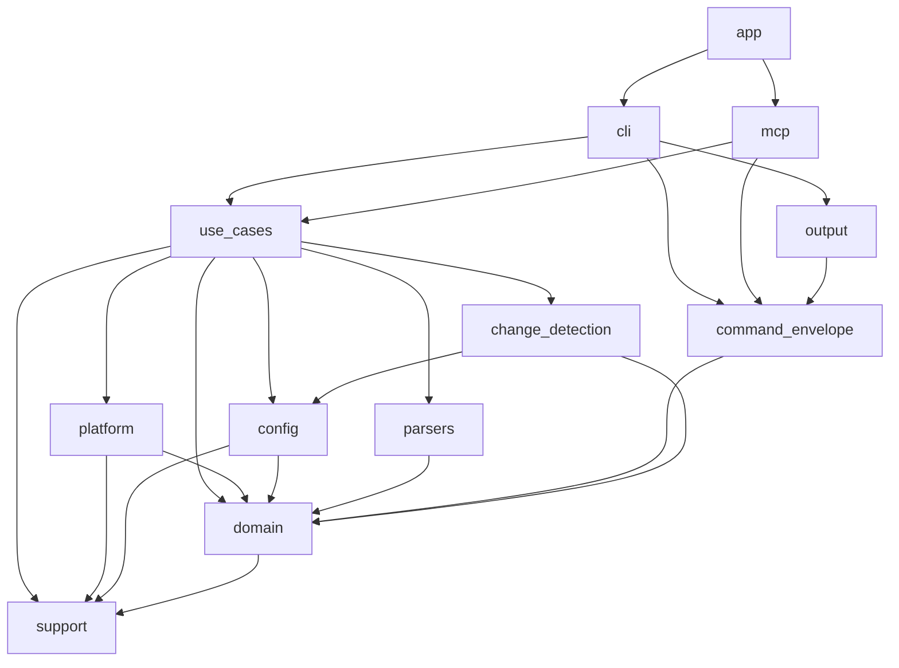

## 5. Строительные блоки

Один бинарный крейт: [`src/main.rs`](../../src/main.rs) объявляет модули верхнего уровня
и передаёт управление `app::run`. Раздел отвечает на вопросы, на которые поиск по коду не
отвечает быстро: чем владеет модуль и куда смотрят его зависимости.

### 5.1 Модули

| Модуль | Чем владеет | С чего читать |
| --- | --- | --- |
| [`app`](../../src/app.rs) | Старт процесса: разбор командной строки, прежние имена команд, отказ несовместимых глобальных ключей, загрузка конфигурации по виду команды, запуск MCP-сервера. Сам исполняет и выводит `version`, `clone`, `init` | `run` |
| [`cli`](../../src/cli/) | Дерево команд, перевод аргументов в запросы, замок `workPath` командной строки, текст и конверт ответа, Ctrl+C и SIGTERM как отмена | [`execute.rs`](../../src/cli/execute.rs), [`global_flags.rs`](../../src/cli/global_flags.rs) — у каких команд есть превью, [`synonyms.rs`](../../src/cli/synonyms.rs) — прежние имена и их записи словаря |
| [`mcp`](../../src/mcp/) | Сервер по stdio и HTTP: допуск вызовов, сессии, входные DTO, сервисный слой над сценариями, замок `workPath` для MCP, живая EDT-проверка, телеметрия | [`server.rs`](../../src/mcp/server.rs), [`service.rs`](../../src/mcp/service.rs), [`port.rs`](../../src/mcp/port.rs) |
| [`use_cases`](../../src/use_cases/) | Сценарии команд — одни и те же для CLI и MCP — и то, что нужно нескольким сценариям сразу — 5.4 | [`context.rs`](../../src/use_cases/context.rs), [`request.rs`](../../src/use_cases/request.rs), [`result.rs`](../../src/use_cases/result.rs) |
| [`domain`](../../src/domain/) | Результаты команд и часть запросов; грамматика исполнения `ExecutionOutcome<T>`, `StepResult`; матрица исполнителей | [`execution.rs`](../../src/domain/execution.rs), [`capability.rs`](../../src/domain/capability.rs) |
| [`config`](../../src/config/) | Чтение `v8project.yaml` и местного слоя, модель `AppConfig`, схемы, проверка по виду команды | [`loader.rs`](../../src/config/loader.rs), [`validate.rs`](../../src/config/validate.rs) |
| [`platform`](../../src/platform/) | Процессы, SSH, загрузка по HTTP, git, браузер — 5.5 | [`utilities.rs`](../../src/platform/utilities.rs) |
| [`change_detection`](../../src/change_detection/) | Обход дерева, отметки времени и хеши, хранилище redb на контекст с привязкой к базе и каталогу, решение о частичной загрузке | [`analyzer.rs`](../../src/change_detection/analyzer.rs), [`partial_load.rs`](../../src/change_detection/partial_load.rs) |
| [`parsers`](../../src/parsers/) | JUnit, журналы YaXUnit и Vanessa, журналы проверки Конфигуратора и EDT. Ответы `ibcmd` и агента разбирают `platform` и сценарии | [`mod.rs`](../../src/parsers/mod.rs) |
| [`output`](../../src/output/) | Вывод командной строки: `Presenter`, словарь текстовой ленты | [`text.rs`](../../src/output/text.rs) |
| [`command_envelope`](../../src/command_envelope.rs) | Конверт ответа `Envelope<T>`, закрытые наборы родов и кодов отказа | `Envelope` |
| [`command_data`](../../src/command_data.rs) | Таблица «команда → схема поля `data`». Программа её не вызывает, по ней тесты сверяют порождённые схемы | `command_data_forms!` |
| [`support`](../../src/support/) | Общая ошибка `AppError`; файловые примитивы — замки, атомарная замена, метаданные временных каталогов; журналы; пути; имя машины и живость её процессов; разбор адресов; нормализация ввода CLI и MCP | [`fs.rs`](../../src/support/fs.rs), [`error.rs`](../../src/support/error.rs) |

### 5.2 Зависимости

Основное направление — сверху вниз. `app` смотрит в большинство модулей; адаптеры, кроме
показанного, берут `domain`, `config` и `support`; друг о друге они не знают.

```mermaid
flowchart TB
    app --> cli & mcp
    cli & mcp --> use_cases
    cli --> output
    cli & mcp & output --> command_envelope
    use_cases --> platform & change_detection & parsers & config & domain & support
    platform & config & parsers & command_envelope --> domain
    change_detection --> config & domain
    platform & config & domain --> support
```

Против направления идут рёбра ниже, и из-за них модули связаны в один большой цикл:
`support → platform` и `support → config` — `AppError` оборачивает их ошибки;
`support → use_cases` — нормализация ввода возвращает типы запросов; `support → output` —
журнал берёт знак статуса из словаря ленты; одно из пары `config ↔ platform` — модель
строит подключение платформы, а платформа читает модель. Мимо сценариев идёт
`mcp → platform` — сервер держит общую сессию EDT, которую отдаёт сценарию живой EDT-проверки ([6.7](06-runtime-view.md)). Ради порождаемых
схем `command_data` смотрит в `app`, `cli` и `mcp`, а `command_envelope` — в `command_data`.

Границы, которые держат правила: сценарии не знают транспорта и вывода
([правило](../rules/use-cases/no-transport-types-in-the-use-case-layer.md)); процесс
запускает только `platform` ([правило](../rules/platform/process-spawn-stays-in-platform.md)),
а файловая система так не ограничена; команду с аргументами показывает только владелец
маскирования ([правило](../rules/platform/command-display-has-one-owner.md)).

### 5.3 Команда → сценарий

Сценарий команды — модуль [`use_cases`](../../src/use_cases/), адаптер — функция
`execute_*` в [`cli/execute.rs`](../../src/cli/execute.rs); `version`, `clone`, `init` и
`mcp serve` разбирает `app.rs`. Имена в коде старше имён команд: `push` — `build_project`,
`pull` — `dump_config`, `upload` — `load_artifact`, `check` — `check_syntax`, `make` —
`artifacts`, `clone` — `bootstrap_project`, `init` — `config_init`, `infobase create` —
`init_project` (в `CommandName` — `Init`), `download`, `infobase dump` и `restore` —
`infobase_export`, `extensions` — `configure_extensions` и `extension_inventory`, `test` —
`run_tests`; остальные названы по команде: `convert_sources`, `launch_app`, `publish_infobase`,
`tools_download`, `status`. Инструменты MCP зовут те же сценарии через `mcp/service.rs`; их состав держит
[правило](../rules/mcp/published-tool-surface.md).

### 5.4 Общее в `use_cases`

| Файл | Что в нём |
| --- | --- |
| [`transport.rs`](../../src/use_cases/transport.rs), [`command_lock.rs`](../../src/use_cases/command_lock.rs), [`workspace_lock.rs`](../../src/use_cases/workspace_lock.rs), [`infobase_lock.rs`](../../src/use_cases/infobase_lock.rs) | Вызов сценария под замком `workPath` и затем под замком файловой базы — общий для CLI и MCP; что команда делает с базой, называет адаптер |
| [`infobase_owner.rs`](../../src/use_cases/infobase_owner.rs) | Метка владельца файловой базы: чья база, запись копии, форма метки; зовёт её только граница в `transport.rs` — [8.3](08-cross-cutting-concepts.md) |
| [`exchange_guard.rs`](../../src/use_cases/exchange_guard.rs) | Проверки перед обменом после владельца: память о базе у набора (`no_memory`) и поколение до и после загрузки и выгрузки (`non_fast_forward`), сверка всех наборов до первой загрузки, пропуск выгрузки при неизменном поколении, признак нового владельца, память созданной базы, восстановление файла версий; единственный, кто строит эти отказы и их `next` (сквозь исполнителей они идут как `AppError::Refused`); журнал поколений — в [`agent_session.rs`](../../src/use_cases/agent_session.rs) — [6.3](06-runtime-view.md) |
| [`status.rs`](../../src/use_cases/status.rs) | `status`: память о базе по наборам — определение памяти и сверка поколения (`predict`) берутся у `exchange_guard.rs` — и с `--deep` поколение исполнителем `push`, состав расширений исполнителем `extensions` (`extension_inventory.rs`), копии из метки (`infobase_owner.rs`); пишет только журналы |
| [`generation_reader.rs`](../../src/use_cases/generation_reader.rs) | Единственное чтение поколения процессом платформы — Конфигуратором и `ibcmd` — для `push`, `pull` и `status --deep`; у агента поколение читает его сессия |
| [`provider_selection.rs`](../../src/use_cases/provider_selection.rs) | Выбор исполнителя и квитанция — [6.2](06-runtime-view.md) |
| [`agent_session.rs`](../../src/use_cases/agent_session.rs) | Сессия агента на команду, обмен файлами, поколение — [6.4](06-runtime-view.md) |
| [`staged_publication.rs`](../../src/use_cases/staged_publication.rs), [`destruction_guard.rs`](../../src/use_cases/destruction_guard.rs) | Публикация с заменой и вопрос к git — [8.8](08-cross-cutting-concepts.md) |
| [`ignored_files.rs`](../../src/use_cases/ignored_files.rs) | Шаблоны `.gitignore` проекта для `init` и `clone`; отказ `pull` и `push`, нашедших опись версий в индексе git — [правило](../rules/use-cases/the-version-file-stays-out-of-version-control.md) |
| [`version_file.rs`](../../src/use_cases/version_file.rs) | Копия файла версий набора под базой; сверка файла в каталоге перед `pull` и `push` ([правило](../rules/use-cases/a-replaced-version-file-gives-way-to-the-runner-copy.md)) и запись после удачи ([правило](../rules/use-cases/the-runner-copy-takes-the-platform-file-after-success.md)); уборка брошенных временных файлов ([правило](../rules/use-cases/a-version-file-replacement-leaves-no-trace.md)); сверка версии формата перед загрузкой ([правило](../rules/use-cases/a-load-from-a-newer-format-is-refused-before-the-platform-starts.md)) |
| [`interruption.rs`](../../src/use_cases/interruption.rs) | Слова о прерывании и учёт отмен, отложенных критической фазой, — [8.7](08-cross-cutting-concepts.md) |
| [`progress.rs`](../../src/use_cases/progress.rs) | События живой ленты текстового вывода |
| [`source_inventory.rs`](../../src/use_cases/source_inventory.rs) | Наборы исходников проекта в порядке обработки (`ordered_by_purpose` решает порядок по назначению); пакеты конфигурации в порядке обхода — [правило](../rules/use-cases/configuration-packages-are-walked-in-the-inventory-order.md); каталог, имя и проверка целей пакетов у `make` и `download` без набора; сопоставление наборов с составом базы — [правило](../rules/use-cases/installed-extensions-are-matched-in-one-place.md) |
| [`installed_extensions.rs`](../../src/use_cases/installed_extensions.rs) | Чтение состава расширений базы исполнителем команды для `pull --all` и `download` без набора |
| [`throwaway_infobase.rs`](../../src/use_cases/throwaway_infobase.rs) | Временная база раннера под `workPath`, в которой `make` и `convert` собирают пакет из исходников, а `convert` разбирает пакет в XML: создание исполнителем (`ibcmd` со своим `--data` или Конфигуратор), загрузка основной конфигурации один раз за прогон, сборка и разбор пакета, уборка своей и брошенных баз; единственный перевод исходников EDT в XML (`edt_sources_to_xml`) — и для сборки файловой базы у `infobase create` — [правило](../rules/use-cases/make-builds-packages-from-sources-in-a-throwaway-base.md) |
| [`set_walk.rs`](../../src/use_cases/set_walk.rs) | Общее у обходов наборов: ответ каждого набора в `sets`, остановка на первом отказе, закрытие ответа обхода |
| [`tool_extension.rs`](../../src/use_cases/tool_extension.rs) | Расширение-инструмент клиентского MCP |
| [`client_address.rs`](../../src/use_cases/client_address.rs) | Адрес клиента у `launch` и у клиента `test`: строка подключения, без неё — `infobase.web.url`, ключ `--via`; отказ толстому клиенту и обычному приложению у автономной цели — [правило](../rules/cli/a-client-goes-by-the-connection-string-before-the-web-address.md) |

### 5.5 `platform`

| Файл | Что в нём |
| --- | --- |
| [`utilities.rs`](../../src/platform/utilities.rs), [`locator.rs`](../../src/platform/locator.rs) | Вход для сценариев; поиск утилит по маске версии — [правило](../rules/platform/platform-tools-are-found-by-version-mask.md) |
| [`process.rs`](../../src/platform/process.rs) | Процесс в своей группе, класс прерывания, снятие группы; клиент `launch` без ожидания — отсоединённым; отметка работы команды (`WorkGiven`), которую ставит запуск процесса; исход утилиты по коду выхода (`ProcessResult::outcome`) — [правило](../rules/platform/exit-codes-are-read-in-the-platform-layer.md) |
| [`connection.rs`](../../src/platform/connection.rs) | Строка подключения выбранной базы и аргументы подключения утилит |
| [`dump_format.rs`](../../src/platform/dump_format.rs) | Версия формата в корне файла версий ([правило](../rules/use-cases/a-missing-version-file-is-known-before-the-platform-starts.md)) и таблица версий, которые пишут замеренные платформы; пока пуста ([правило](../rules/use-cases/a-foreign-format-version-turns-the-dump-full.md)) |
| [`designer.rs`](../../src/platform/designer.rs), [`ibcmd.rs`](../../src/platform/ibcmd.rs), [`edt.rs`](../../src/platform/edt.rs), [`enterprise.rs`](../../src/platform/enterprise.rs), [`webinst.rs`](../../src/platform/webinst.rs) | Команды утилит; итог — [`PlatformCommandResult`](../../src/platform/result.rs) |
| [`agent.rs`](../../src/platform/agent.rs), [`sftp.rs`](../../src/platform/sftp.rs) | Агент Конфигуратора и шлюз по встроенному SSH; SFTP поверх того же соединения |
| [`interactive.rs`](../../src/platform/interactive.rs), [`edt_session.rs`](../../src/platform/edt_session.rs) | Долгий процесс `1cedtcli` и общая сессия EDT над ним — [8.9](08-cross-cutting-concepts.md) |
| [`git.rs`](../../src/platform/git.rs), [`download.rs`](../../src/platform/download.rs), [`browser.rs`](../../src/platform/browser.rs) | `git`, загрузка по HTTPS, открытие адреса браузером |
| [`secrets.rs`](../../src/platform/secrets.rs) | Маскирование секретов в показанных командах |
