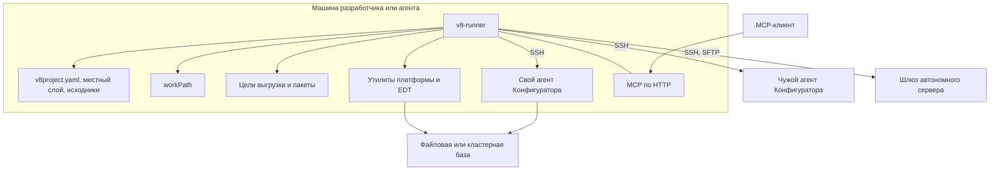

## 7. Развёртывание

- Процессы: сам раннер; утилиты — дочерними процессами в своих группах, клиент `launch`
  без ожидания — отсоединённым; свой агент
  Конфигуратора — на время команды, на петлевом адресе; общая сессия EDT — на время
  команды или всё время работы MCP-сервера.
- Чужого агента и шлюз раннер не запускает. Пути в командах шлюза разрешаются на его
  стороне, файлы идут объявленным каналом, `workPath` остаётся локальным.
- Раннер пишет в `workPath`, в каталог, где лежит цель, — промежуточная и резервная копии
  создаются рядом с ней, — и в каталог обмена чужого агента или шлюза.
- MCP по HTTP слушает `mcp.http.bind_address` и клиента не аутентифицирует — [8.11](08-cross-cutting-concepts.md).
- Своей СУБД и службы у раннера нет.

Правила: [`workPath` всегда локален](../rules/config/workpath-is-always-local.md),
[пути цели разрешаются на её стороне](../rules/platform/target-side-paths-resolve-on-the-target.md),
[свой агент — только на локальной точке входа](../rules/platform/managed-mode-requires-a-local-endpoint.md),
[агенту файловой и кластерной цели нужна локальная платформа](../rules/platform/an-agent-for-a-file-or-cluster-target-needs-the-local-platform.md).
